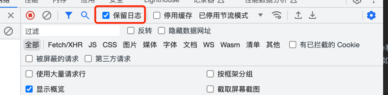
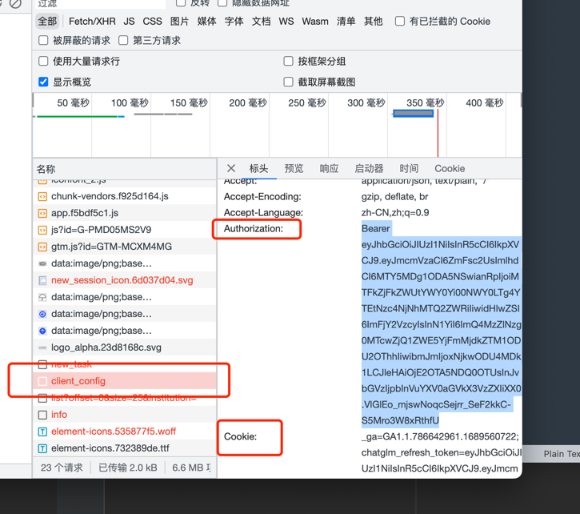

# GPT大语言模型

## 1. chatGLM-130B

由于chatGLM-130B做了爬虫检测，在网页上查看请求的cookie和authorization时，会自动跳转到空白网页。
所以，需要绕过检测直接拿到cookie和authorization。方法如下：

1. 打开开发者工具，并勾选“保存日志”，如下图

2. 在打开的网页上输入测试网址：https://chatglm.cn/detail ，并点击访问
3. 查找`client_config`请求对应的**Authorization**和**Cookie**即可，如下图

