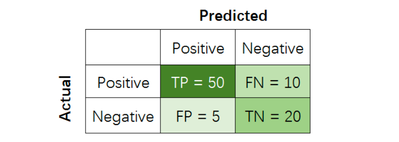
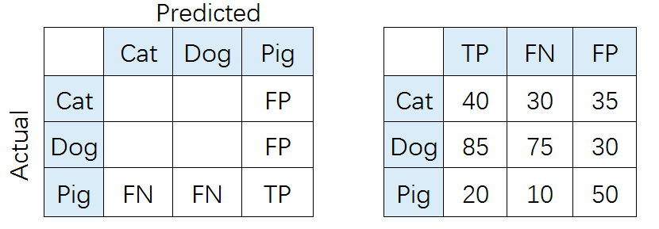

# interview

## 1. 常见问题

### 1.1 二分类问题常用评价指标

+ 准确率 Accuracy
+ 精准度 Precision
+ 召回率 Recall
+ F值   F1

如下图所示，

其中，

+ True Positive (TP): 把正样本成功预测为正。
+ True Negative (TN)：把负样本成功预测为负。
+ False Positive (FP)：把负样本错误地预测为正。
+ False Negative (FN)：把正样本错误的预测为负。

$$ Acc = \frac{TP + TN}{TP + FP + TN + FN} $$
$$ P   = \frac{TP}{TP + FP} $$
$$ R   = \frac{TP}{TP + FN} $$
$$ F1  = \frac{2*P*R}{P + R} $$

其中，Precision着重评估在预测为Positive的所有数据中，真实Positive的数据到底占多少？
Recall着重评估：在所有的Positive数据中，到底有多少数据被成功预测为Positive?

### 1.2 多分类常用评价指标

和二分类问题类似，多分类常用的评价指标也是Acc, P, R和F1。

指标计算步骤：

1. 分别计算各个类别的P, R, F1值。
2. 使用Macro-average、Weighted-average或Micro-average等方法进行各类别指标融合

如下图所示：

**Macro-average方法**

该方法最简单，直接将不同类别的评估指标（Precision/ Recall/ F1-score）加起来求平均， 给所有类别相同的权重。
该方法能够平等看待每个类别，但是它的值会受稀有类别影响。

$$ P = \frac{P_{Cat} + P_{Dog} + P_{Pig}}{3} $$
$$ R = \frac{R_{Cat} + R_{Dog} + R_{Pig}}{3} $$
$$ F1 = \frac{F1_{Cat} + F1_{Dog} + F1_{Pig}}{3} $$

**Weighted-average方法**

该方法给不同类别不同权重（权重根据该类别的真实分布比例确定），每个类别乘权重后再进行相加。
该方法考虑了类别不平衡情况，它的值更容易受到常见类（majority class）的影响。

$$ P = W_{Cat}*P_{Cat} + W_{Dog}*P_{Dog} + W_{Pig}*P_{Pig} $$
$$ R = W_{Cat}*R_{Cat} + W_{Dog}*R_{Dog} + W_{Pig}*R_{Pig} $$
$$ F1 = W_{Cat}*F1_{Cat} + W_{Dog}*F1_{Dog} + W_{Pig}*F1_{Pig} $$
$$ W_{Cat}:W_{Dog}:W_{Pig} = N_{Cat}:N_{Dog}:N_{Pig} $$

其中，W代表权重，N代表样本在该类别下的真实数目

**Micro-average方法**

该方法把每个类别的TP, FP, FN先相加之后，在根据二分类的公式进行计算。

**注意：**

+ Accuracy度量的是全局样本预测情况。
+ Macro-average能够平等看待每个类别，但是它的值会受稀有类别影响。
+ Weighted-average考虑了类别不平衡情况，它的值更容易受到常见类（majority class）的影响。
+ Micro-average的Accuracy = P = R = F1
