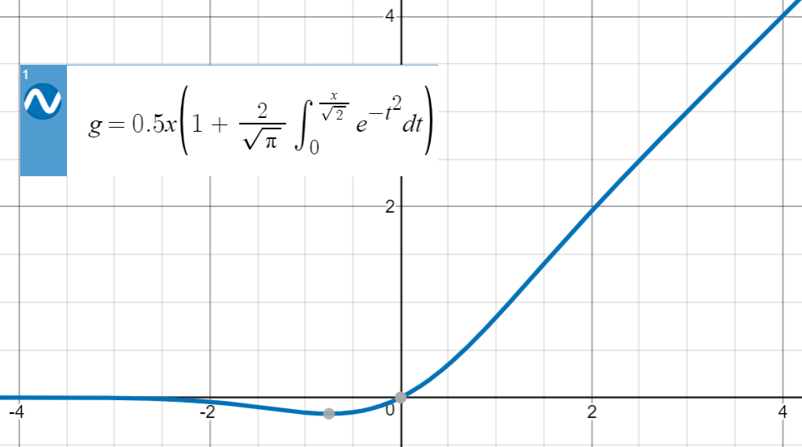
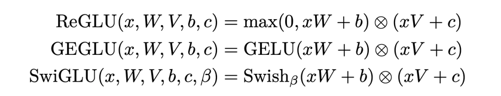

# interview 常见问题

## 1. 分类问题

### 1.1 二分类问题常用评价指标

+ 准确率 Accuracy
+ 精准度 Precision
+ 召回率 Recall
+ F值   F1

如下图所示，

其中，

+ True Positive (TP): 把正样本成功预测为正。
+ True Negative (TN)：把负样本成功预测为负。
+ False Positive (FP)：把负样本错误地预测为正。
+ False Negative (FN)：把正样本错误的预测为负。

$$
Acc = \frac{TP + TN}{TP + FP + TN + FN}
$$

$$
P   = \frac{TP}{TP + FP}
$$

$$
R   = \frac{TP}{TP + FN}
$$

$$
F1  = \frac{2*P*R}{P + R}
$$

其中，Precision着重评估在预测为Positive的所有数据中，真实Positive的数据到底占多少？
Recall着重评估：在所有的Positive数据中，到底有多少数据被成功预测为Positive?

### 1.2 多分类常用评价指标

和二分类问题类似，多分类常用的评价指标也是Acc, P, R和F1。

指标计算步骤：

1. 分别计算各个类别的P, R, F1值。
2. 使用Macro-average、Weighted-average或Micro-average等方法进行各类别指标融合

如下图所示：

**Macro-average方法**

该方法最简单，直接将不同类别的评估指标（Precision/ Recall/ F1-score）加起来求平均， 给所有类别相同的权重。
该方法能够平等看待每个类别，但是它的值会受稀有类别影响。

$$
P = \frac{P_{Cat} + P_{Dog} + P_{Pig}}{3}
$$

$$
R = \frac{R_{Cat} + R_{Dog} + R_{Pig}}{3}
$$

$$
F1 = \frac{F1_{Cat} + F1_{Dog} + F1_{Pig}}{3}
$$

**Weighted-average方法**

该方法给不同类别不同权重（权重根据该类别的真实分布比例确定），每个类别乘权重后再进行相加。
该方法考虑了类别不平衡情况，它的值更容易受到常见类（majority class）的影响。

$$
P = W_{Cat}*P_{Cat} + W_{Dog}*P_{Dog} + W_{Pig}*P_{Pig}
$$

$$
R = W_{Cat}*R_{Cat} + W_{Dog}*R_{Dog} + W_{Pig}*R_{Pig}
$$

$$
F1 = W_{Cat}*F1_{Cat} + W_{Dog}*F1_{Dog} + W_{Pig}*F1_{Pig}
$$

$$
W_{Cat}:W_{Dog}:W_{Pig} = N_{Cat}:N_{Dog}:N_{Pig}
$$

其中，W代表权重，N代表样本在该类别下的真实数目

**Micro-average方法**

该方法把每个类别的TP, FP, FN先相加之后，在根据二分类的公式进行计算。

**注意：**

+ Accuracy度量的是全局样本预测情况。
+ Macro-average能够平等看待每个类别，但是它的值会受稀有类别影响。
+ Weighted-average考虑了类别不平衡情况，它的值更容易受到常见类（majority class）的影响。
+ Micro-average的Accuracy = P = R = F1

## 2. 神经网络中常用的激活函数

神经网络中为了增强模型的表达能力，引入了非线性激活函数。
神经网络模型在训练过程中依赖误差后向传播方法进行梯度计算和参数更新，所以，激活函数需要是可导的。
常见激活函数对比如下图：

### 2.1 Scaled Dot-Product Attention

$$
out = softmax(\frac{Q \times K^{T}}{\sqrt{d}}) \times V, \\ 
Q, K, V \in N^{n \times d}
$$

缩放的点积请注意力是transformer中常用的结构，它的计算时间复杂度为$O(n^2d)$。
因此，它的缺点为当输入序列过长时，计算效率很低

### 2.2 sigmoid

计算公式：

$$
\sigma(z) = \frac{1}{1 + e^{-z}}
$$

函数图像：

导数图像：

**优点：**

1. sigmoid函数连续可导，且导数易求, $ f'(x) = f(x) * (1 - f(x)) $
2. sigmoid可用于二分类或回归问题（用于回归时，值域需要进行0-1的归一化）

**缺点：**

1. 函数值域为(0,1)，故导数小于1，用过深度神经网络时，会出现vanishing gradient问题
2. 训练过程中，当loss较小时，收敛速度会变慢，因为梯度会变小甚至接近0

### 2.3 ReLU: Rectified Linear Unit

计算公式：

$$
ReLU(x) = max(x, 0)
$$

函数图像：

导数图像：

**优点：**

1. 计算简单，效率高
2. 梯度为0或者1，不会出现梯度消失问题

**缺点：**

1. ReLU在0点不可导
2. ReLU无法输出负数激活值，不适用于有负数输入的情形
3. 会导致dying ReLU问题，即部分神经元死亡（一直接收负数输入，并输出0）

### 2.4 GELU: Gaussian Error Linear Unit

计算公式：

其中，erf(x)为误差函数，也称为高斯误差函数，

高斯误差函数图像为

GELU函数图像：

**优点：**
1. 处处连续可导
2. 结合了ReLU和dropout的优点，输入$x$越小，$\Phi(x)$越小，达到dropout效果
3. 输入为负时，可输出负的激活值

**缺点：**
1. 计算比较复杂，由于erf无解析表达式，常用近似方法来计算

### 2.5 Swish: Self-Gated activation function

计算公式：
$$ f(x) = x*\sigma(\beta x) $$

Swish函数图像：

**优点：**
1. 处处连续可导且光滑，易于训练

**缺点：**
1. 不够稳定，对特定任务比较敏感，有时不如ReLU
2. 有多余的超参$\beta$需要学习

### 2.6 GLU: Gated Linear Unit
计算公式：

GLU的其它变种：

应用了GLU的各种feedforward层：

