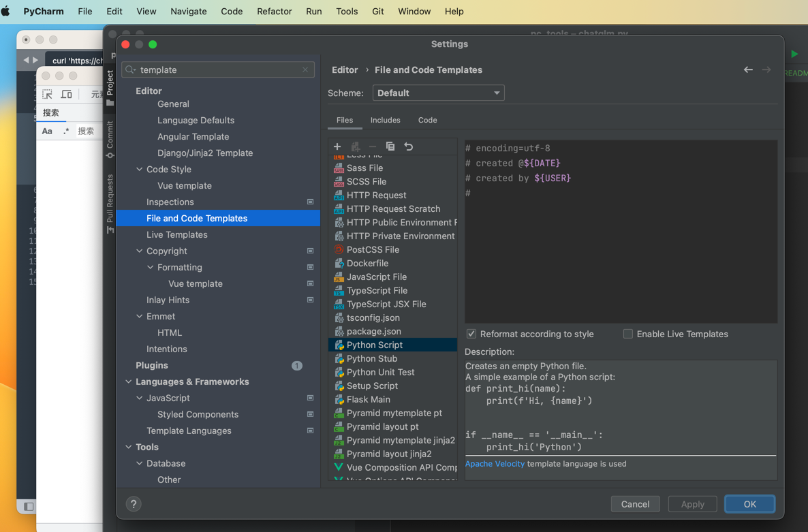
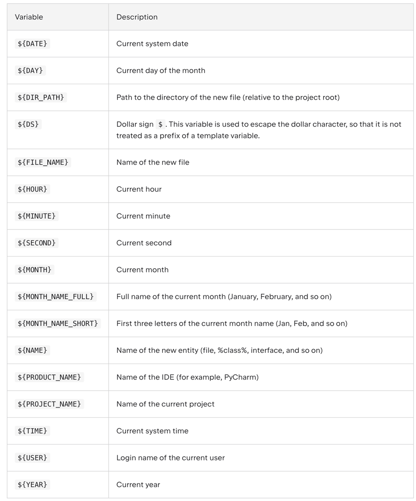
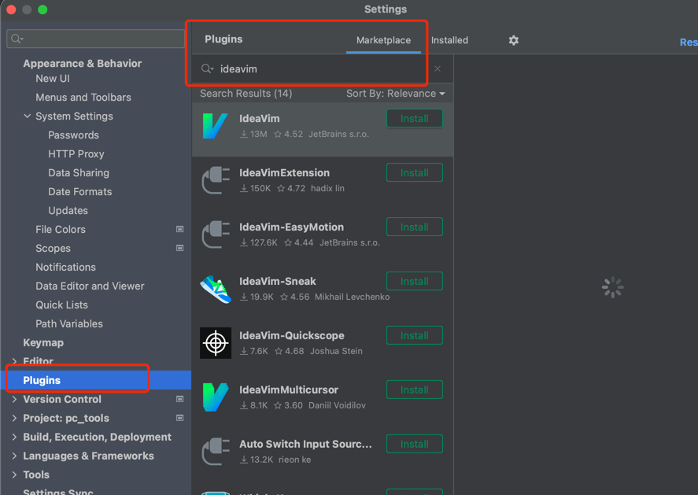

# pycharm使用

## 1. 代码模板使用
修改python代码模板后，在创建py文件时，可直接生成相应的代码模板，
可以在模板中添加代码创建的相关信息，如作者、创建日期等，非常实用。

### 1.1 创建步骤
1. 设置路径：Pycharm --> Settings
2. 搜索`template`，并找到**File and Code Templates**
3. 打开相应的类型模板，如py文件的**Python Script**模板文件
4. 编辑模板文件，如
    ```python
    # encoding=utf-8
    # created @${DATE}
    # created by ${USER}
    # 
    ```

整个过程如下：


### 1.2 变量意义
参考网址：https://www.jetbrains.com/help/pycharm/file-template-variables.html#predefined_template_variables



## 2. pycharm插件安装

插件安装路径：PyCharm(左上角) -> settings -> Plugins(中部) -> Marketplace

然后搜索相关插件并点击`Install`进行安装即可，如下图所示：

